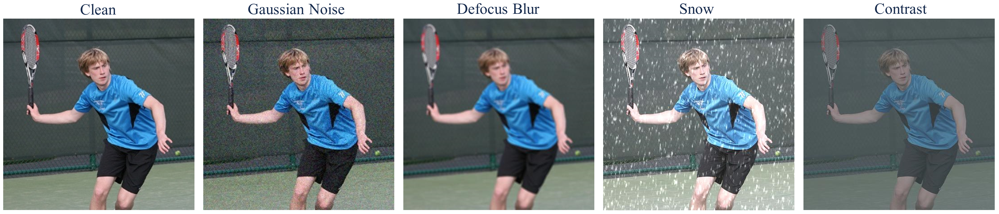
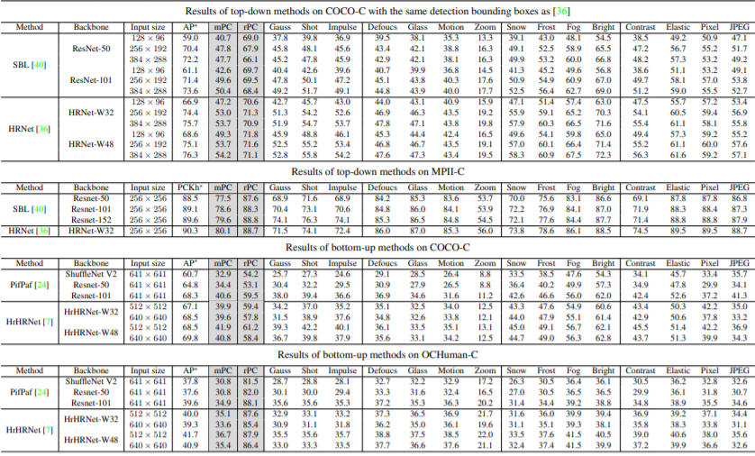
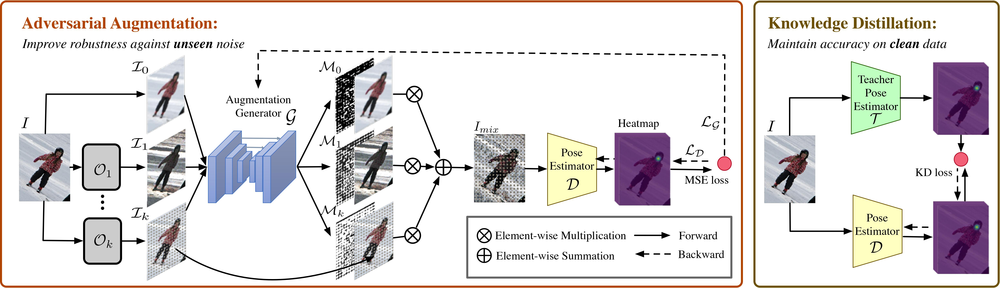
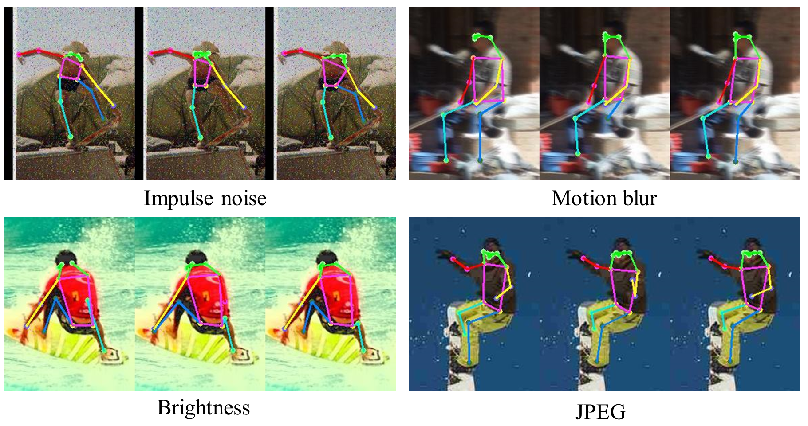

# AdvMix
Official code for our CVPR 2021 paper: ["When Human Pose Estimation Meets Robustness: Adversarial Algorithms and Benchmarks"](https://arxiv.org/abs/2105.06152).

## Getting started
* Installation
```
# clone this repo
git clone https://github.com/AIprogrammer/AdvMix
# install dependencies
pip install -r requirements
# make nms
cd AdvMix
cd lib
make
# install cocoapi
# COCOAPI=/path/to/clone/cocoapi
git clone https://github.com/cocodataset/cocoapi.git $COCOAPI
cd $COCOAPI/PythonAPI
# Install into global site-packages
make install
# Alternatively, if you do not have permissions or prefer
# not to install the COCO API into global site-packages
python3 setup.py install --user
```

* Download the datasets [COCO](https://cocodataset.org/), [MPII](http://human-pose.mpi-inf.mpg.de/), and [OCHuman](https://github.com/liruilong940607/OCHumanApi). Put them under "./data". The directory structure follows [HRNet](https://github.com/leoxiaobin/deep-high-resolution-net.pytorch).

## Benchmarking
### Contruct benchmarking datasets
```
sh scripts/make_dataset.sh
```
### Visualization examples

### Benchmark results


## AdvMix

### Training

* MPII
```
sh scripts/train.sh mpii
```
* COCO
```
sh scripts/train.sh coco
```

### Evaluation
```
sh scripts/test.sh coco
sh scripts/test.sh mpii
```

### Quantitative results
|   Method | Arch               | Input size | AP<sup>*</sup>  |  mPC   |   rPC |
| Standard |--------------------|------------|--------|--------|-------|
|  AdvMix  |      ResNet_50     |    256x192 | 70.4   |   47.8 | 67.9  |
| Standard |      ResNet_50     |    256x192 | 70.1   |   50.1 | 71.5  |
|  AdvMix  |     ResNet_101     |    256x192 | 71.4   |   49.6 | 69.5  |
| Standard |     ResNet_101     |    256x192 | 71.3   |   52.3 | 73.3  |
|  AdvMix  |     ResNet_152     |    256x192 | 72.0   |   50.9 | 70.7  |
| Standard |     ResNet_152     |    256x192 | 72.3   |   53.2 | 73.6  |
|  AdvMix  |     HRNet_W32      |    256x192 | 74.4   |   53.0 | 71.3  |
| Standard |     HRNet_W32      |    256x192 | 74.7   |   55.5 | 74.3  |
|  AdvMix  |     HRNet_W48      |    256x192 | 75.1   |   53.7 | 71.6  |
| Standard |     HRNet_W48      |    256x192 | 75.4   |   57.1 | 75.7  |
|  AdvMix  |     HrHRNet_W32    |    512x512 | 67.1   |   39.9 | 59.4  |
| Standard |     HrHRNet_W32    |    512x512 | 68.3   |   45.4 | 66.5  |


Comparisons between standard training and AdvMix on COCO-C. For top-down approaches, results are obtained with detected bounding boxes of [HRNet](https://github.com/leoxiaobin/deep-high-resolution-net.pytorch/). We see that mPC and rPC are greatly improved, whilst clean performance AP<sup>*</sup> can be preserved

### Visualization results

Qualitative comparisons between HRNet without and with AdvMix. For each image triplet, the images from left to right are ground truth, predicted results of Standard HRNet-W32, and predicted results of HRNet-W32 with AdvMix.

# Citations
If you find our work useful in your research, please consider citing:
```
@article{wang2021human,
  title={When Human Pose Estimation Meets Robustness: Adversarial Algorithms and Benchmarks},
  author={Wang, Jiahang and Jin, Sheng and Liu, Wentao and Liu, Weizhong and Qian, Chen and Luo, Ping},
  journal={arXiv preprint arXiv:2105.06152},
  year={2021}
}
```

# License
Our research code is released under the MIT license. See [LICENSE](./LICENSE) for details.

# Acknowledgments
Thanks for open-source code [HRNet](https://github.com/leoxiaobin/deep-high-resolution-net.pytorch/).


